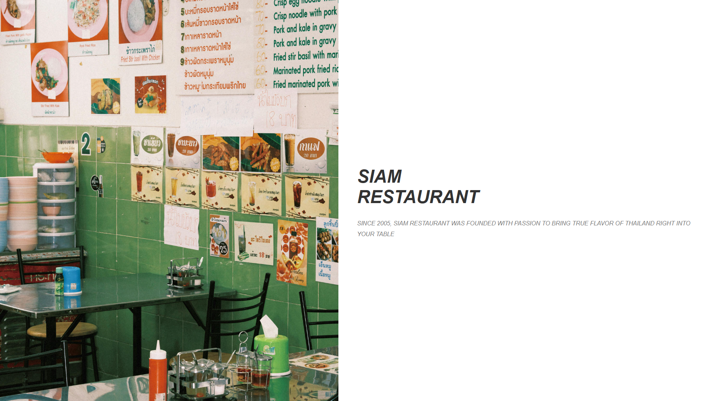
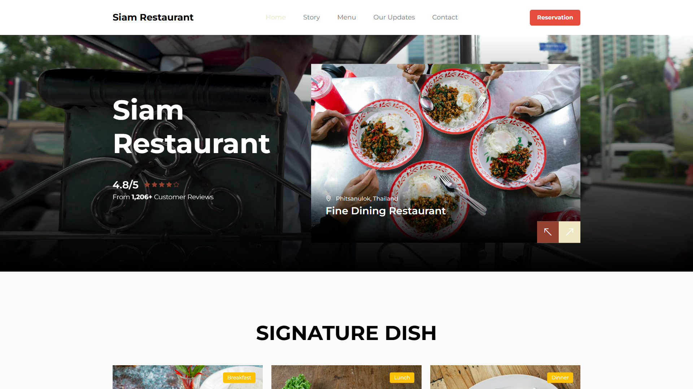
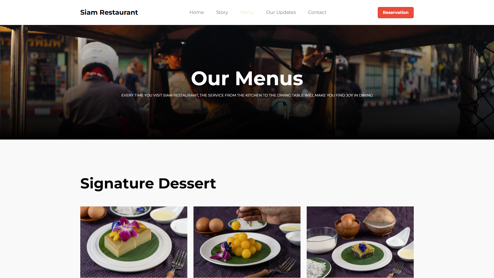
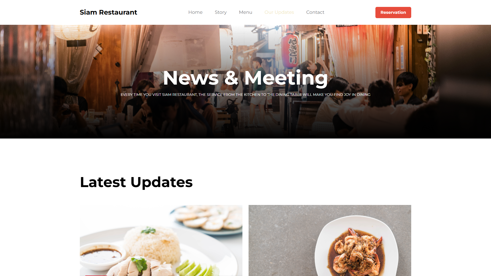
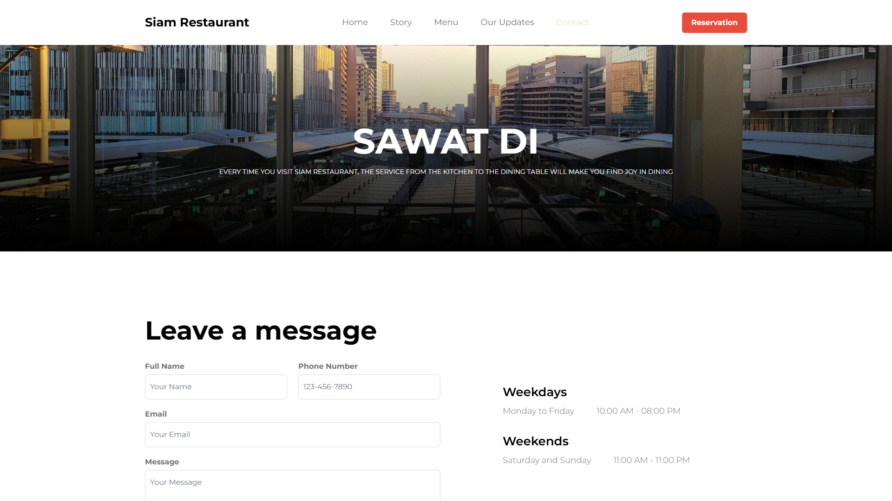

# Siam Restaurant (ร้านอาหารสยาม)

ยินดีต้อนรับสู่ **Siam Restaurant**! ร้านอาหารของเราก่อตั้งขึ้นในปี 2005 ด้วยความตั้งใจที่จะนำเสนอรสชาติอาหารไทยแท้ๆ สู่โต๊ะอาหารของคุณ
โปรเจกต์นี้เป็นเว็บไซต์ Responsive แบบ Static ที่จัดทำขึ้นเพื่อแสดงเมนูอาหารไทยต้นตำรับ ข่าวสาร กิจกรรม และที่ตั้งของร้านอาหาร

---

## ตัวอย่างหน้าเว็บไซต์

### หน้าแรก (Landing Page)
หน้าต้อนรับเริ่มต้นของร้านอาหารเรา

### หน้าหลัก (Home Page)
ภาพรวมที่สวยงามซึ่งบอกเล่าเรื่องราวของร้าน เมนูยอดฮิต และบรรยากาศภายในร้าน

### เมนูอาหาร (Menu)
รายการอาหารแสนอร่อยแบบจัดเต็ม (อาหารเช้า, อาหารกลางวัน, อาหารเย็น)

### ข่าวสารและกิจกรรม (News & Events)
อัปเดตข้อมูลข่าวสารเกี่ยวกับการเปิดสาขาใหม่ เมนูพิเศษจากเชฟ และอื่นๆ

### ติดต่อเรา (Contact Us)
รายละเอียดที่ตั้งของร้านและแบบฟอร์มสำหรับติดต่อสอบถาม

---

## เครื่องมือที่ใช้พัฒนา

* HTML5 & CSS3
* JavaScript
* [Bootstrap](https://getbootstrap.com/)
